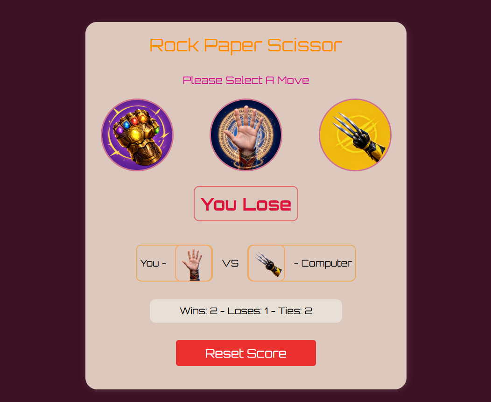

# Rock Paper Scissors Game 🎮

A simple Rock Paper Scissors game built with **HTML, CSS, and JavaScript**.

This is my first JavaScript project, created while learning the basics of JavaScript.




## ✨ Features

* Play Rock Paper Scissors against the computer
* Score tracking
* Simple and responsive UI
* Unique superhero-themed hand icons for Rock, Paper, and Scissors

## 🦸 Superhero-Themed Moves

To make this small project more fun and interesting, I used different superhero-inspired hand designs for each move:

* 🪨 **Rock** — Thanos's Infinity Gauntlet
* 📄 **Paper** — Doctor Strange's Hand
* ✂️ **Scissors** — Wolverine's Hand

This was a simple creative idea to give the classic Rock Paper Scissors game a more unique visual style.

## 🛠️ Technologies

* HTML
* CSS
* JavaScript

## 🎮 How to Play

Choose **Rock, Paper, or Scissors**, and the computer will randomly choose its move.

The winner is decided by the classic Rock Paper Scissors rules.

## 📁 Project Structure

```text
Rock-Paper-Scissor-Game/
│
├── index.html
├── style.css
├── script.js
└── resources/
```

## 🚀 About This Project

I built this project to practice JavaScript fundamentals and understand how JavaScript can make a webpage interactive.

Although this is a small project, I wanted to make it a little more interesting by using superhero-inspired hand icons instead of ordinary Rock, Paper, and Scissors images.
